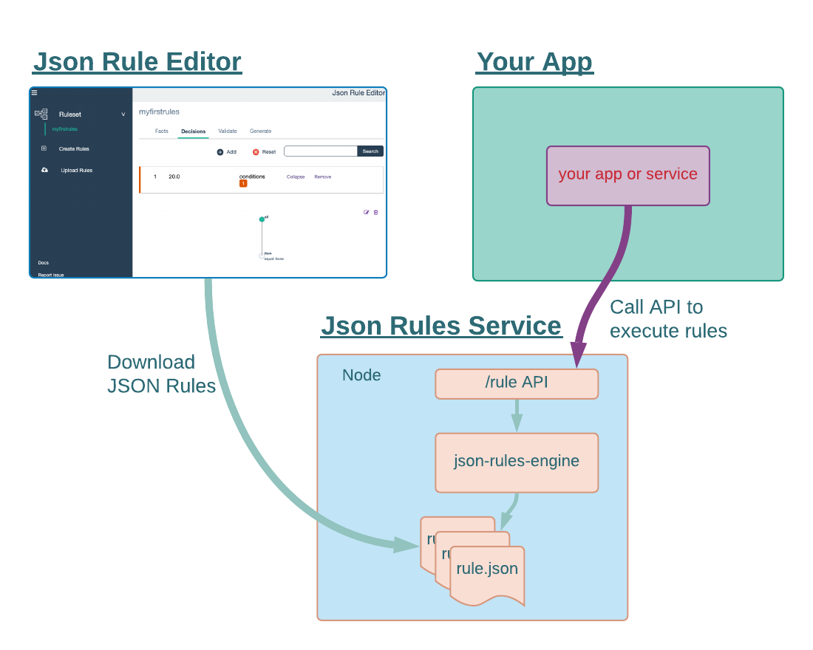

## json-rules-service

### Getting Started

Json rules service wraps the [json-rules-engine](https://github.com/CacheControl/json-rules-engine) in an API that allows you to run your business rules and decision outcomes via an external service. A simple POST API to effortlesly run business rules defined in json files created using [json-rule-editor](https://github.com/vinzdeveloper/json-rule-editor).

Process to implement json rule file in the service is as follows

- Generate rule file using json rule editor
- Place the generated file in the `src/rules` folder,
- and pass the name of the file (without .json) and input parameters to the API to get the output.

### Usage:

To launch the json rule editor tool, you can do either of the below

1. Click [json rule editor](https://www.json-rule-editor.com)
2. or install it locally via `git clone https://github.com/vinzdeveloper/json-rule-editor.git`
   - start the application by `npm install` and `npm start`
3. Create your business rules and then download the json file to `src/rules/`. The detailed steps to create json rule file using this tool can be found [here](https://vinzdeveloper.github.io/json-rule-editor/docs/create-rules.html).
4. Start the rules service by running `npm install` and `npm start`
5. Call the API to execute your rules:

```
    curl --location --request POST 'http://localhost:3000/rule' \
          --header 'Content-Type: application/json' \
          --data-raw '{
               "inputs": {
                    "item": "bone"  <-- facts/inputs you created for your rule
               },
               "rules" : "discount-rules"  <-- name of your rules json file
          }'

```


